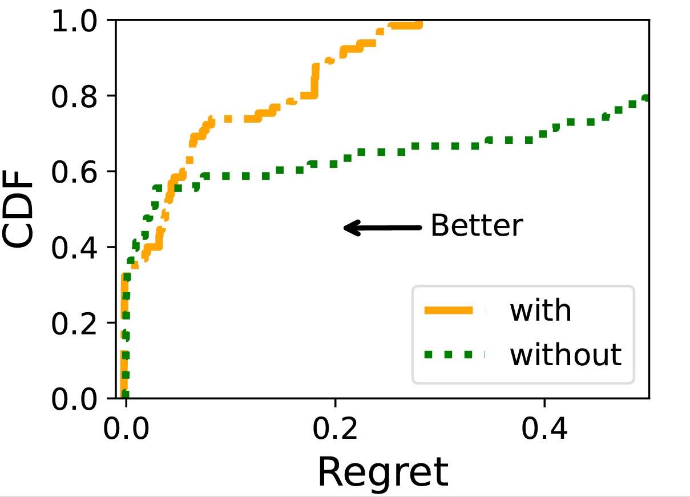

# xSlice_Paper Erratum Statement Jan 2025


## Missing Figure in [Near-Real-Time Resource Slicing for QoS Optimization in 5G]

Date: [1/15/2025]

Paper Title: [Near-Real-Time Resource Slicing for QoS Optimization in 5G]

The first Author: [Peihao Yan]

<!-- Journal Details (if applicable): [Insert Details] -->

## Description of the Issue
We recently discovered an error in our submitted paper titled "[Near-Real-Time Resource Slicing for QoS Optimization in 5G]," where Figure.7 was unintentionally omitted during the final manuscript preparation. Because of missing the figure, the paper includes a placeholder ("??"). We deeply regret this oversight and sincerely apologize for any confusion caused.

In our paper, an error was identified in **Section V: xSlice Design**, subsection **D: Penalty Definition and Policy Updates**, on **pages 7-8**. Specifically, when discussing the following statement:

```bash
“We measure the regret value of xSlice both with and without this penalty mechanism. Fig. 7 presents our experimental results. It can be seen that, without the penalty mechanism, the regret is distributed over a large range. In comparison, the penalty mechanism can significantly reduce regret, thus improving the quality of service of all sessions.”
```

## Corrective Action
To address this issue, we have uploaded the missing figure to this repository for reference. You can find it below:



Alternatively, you can download the figure directly from the following link: [https://github.com/peihaoY/xSlice_Paper/tree/main/fig/with&without_Penalty.pdf].

Additional Information
We are currently working to update the published paper (if permitted by the journal) and ensure such errors do not occur in the future.

We thank the community for your understanding and welcome any further questions or concerns.
