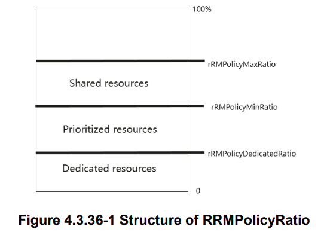

# Slicing in NR MAC Scheduler

`nr_schedule_ue_spec()` is divided into two parts:
1. **Pre-processor** makes the scheduling decisions by **slice-** and **user-** levels scheduling [1] [2]
2. **Post-processor** fills the scheduling decisions into nFAPI structures to indicate to the PHY 

The pre-processor is defined by the structure `nr_pp_impl_param_dl_t` and
it is initialized by `nr_init_fr1_dlsch_preprocessor()` in `mac_top_init_gNB()`:
```c
RC.nrmac[i]->pre_processor_dl = nr_init_fr1_dlsch_preprocessor(0);
```

In addition, the algorithm for slice-level scheduler 
is defined by the structure `nr_pp_impl_dl` and
is assigned by the function pointer `nr_fr1_dlsch_preprocessor()` by default, which is _none_ slicing algorithm (means there is no slices in the system to be scheduled).
On the other hand, the algorithm for user-level scheduler
is defined by the structure `nr_dl_sched_algo_t` and
is assigned by the structure pointer `nr_proportional_fair_wbcqi_dl` by default, which is adopting _proportional fair_ algorithm (`nr_pf_dl()`) to schedule the UEs.
Both schedulers are initialized in `nr_init_fr1_dlsch_preprocessor()`:
```c
nr_pp_impl_param_dl_t impl;
memset(&impl, 0, sizeof(impl));
impl.dl = nr_fr1_dlsch_preprocessor;
impl.dl_algo = nr_proportional_fair_wbcqi_dl;
```

## Slice-level Scheduler
The slice-level scheduler in pre-preprocessor is enabled by calling
`gNB_mac->pre_processor_dl.dl()` in `nr_schedule_ue_spec()`.

Through Near-Real-Time RIC, xApp and RAN Control (RC) service model,
the slice-level scheduler can be customized to other algorithm on-the-fly.
> For an example,NVS [3] algorithm is implemented in the `nr_slicing.c`,
and it is initialized through `set_new_dl_slice_algo()` in the RC RAN function `E2AP/RAN_FUNCTION/rc_ran_func.c`:
> ```c
> switch (algo) {
>     case NVS_SLICING:
>       nrmac->pre_processor_dl = nvs_nr_dl_init(mod_id);
>       break;
>     default:
>       nrmac->pre_processor_dl.algorithm = 0;
>       nrmac->pre_processor_dl = nr_init_fr1_dlsch_preprocessor(0);
>       nrmac->pre_processor_dl.slices = NULL;
>       break;
> }
> ```
> In `nvs_nr_dl_init()`, the slice-level scheduler is changed to point to the function `nvs_nr_dl()`,
which will be called by `gNB_mac->pre_processor_dl.dl()` in the pre-processor to schedule the slices based on the NVS algorithm.

To implement different slice-level scheduling algorithm,
you can start from `nr_slicing.h` by adding the parameters related to your scheduling algorithm
and init function (e.g., `nvs_nr_dl_init()`).
Afterwards, you can start create the corresponding functions which are used in your init function,
> take an example in `nvs_nr_dl_init()`, these are the required functions need to be implemented:
> - `nvs_nr_dl()` is the function for your slice-level scheduling algorithm (i.e, select a slice, or sort slices)
> - `addmod_nvs_nr_slice_dl()` is the function to add or modify the setting/configuration of existing slices (i.e., increase the capacity, change user-level scheduling algorithm)
> - `remove_nvs_nr_slice_dl()` is the function to remove the slice from the existing slices
> - `nvs_nr_destroy()` is the function to delete all the slices in the system


## User-level Scheduler
The user-level scheduler in pre-preprocessor is enabled by calling
`RC.nrmac[module_id]->pre_processor_dl.dl_algo.run()` in `nr_fr1_dlsch_preprocessor()` by default.
> Once the NVS algorithm is applied to the slice-level scheduler, the user-level scheduler is enabled by calling
> `si->s[maxidx]->dl_algo.run()` in `nvs_nr_dl()`.

Note that the algorithm of user-level scheduler also can be customized for each slice, for an example,
the user-level scheduling algorithm `nr_proportional_fair_wbcqi_dl` is defined in `gNB_scheduler_dlsch.c`:
```c
nr_dl_sched_algo_t nr_proportional_fair_wbcqi_dl = {
  .name  = "nr_proportional_fair_wbcqi_dl",
  .setup = nr_pf_dl_setup,
  .unset = nr_pf_dl_unset,
  .run   = nr_pf_dl,
  .data  = NULL
};
```
By following above structure `nr_dl_sched_algo_t`,
the other user-level scheduling algorithm can be implemented and be assigned to different slices,
> for an example, in `addmod_nvs_nr_slice_dl()`:
> ```c
> s->dl_algo = *(nr_dl_sched_algo_t*) algo;
> ```

## Examples
### Enable 3GPP slices (NSSAI-based) by using NVS algorithm to achieve minimum PRB Ratio
The NVS scheduling algorithm, as detailed in the referenced paper [3],
operates by determining the maximum weight for slices in each time slot.
The weight represents the marginal utility of each slice with respect to the achieved cumulative fraction of resources.
At each time slot,
the algorithm selects the slice with the highest weight,
and allocate the resource to the UEs associated to the selected slice.
> For instance, if there are two slices 
and both are set to use 50% of the resources from system (assuming there are 8 downlink slots in 5 sub-frames),
every time slot will utilize 100% of Resource Blocks (RBs) for the chosen slice.
To be more concrete, the selected slots for two slices could be as follows:
> - slice 1 occupies 0, 2, 4, 6th slot
> - slice 2 occupies 1, 3, 5, 7th slot

Based on the _RRMPolicyRatio_ defined by 3GPP TS 28.541 v16.6, as shown in below figure,
the prioritized resource can be achieved by using type `NVS_RES` and parameter `pct_reserved` from NVS algorithm.
These resources are preferentially used by the associated slice, and 
are guaranteed for use by the associated slice when it needs to use them.
When not used, these resources may be used by other slices.
Therefore, in the RC RAN function, `pct_reserved` is assigned by `Min_PRB_Policy_Ratio` which is given by xApp via Near-Real-Time RIC,
to configure the slices.


### References
- [1] [SLICING IN HETEROGENEOUS SOFTWARE-DEFINED RADIO ACCESS NETWORKS](https://www.eurecom.fr/en/publication/6635)
- [2] [FLEXSLICE: FLEXIBLE AND REAL-TIME PROGRAMMABLE RAN SLICING FRAMEWORK](https://www.eurecom.fr/en/publication/7416) 
- [3] [NVS: A Substrate for Virtualizing Wireless Resources in Cellular Networks](https://ieeexplore.ieee.org/document/6117098)